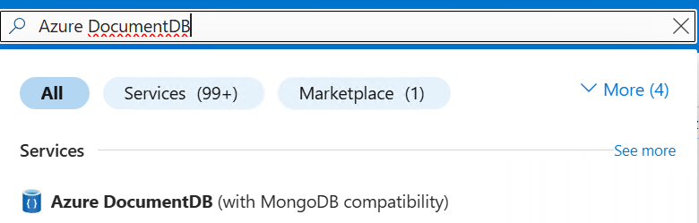

# Create or Verify the Target Cluster

[Back to Module 1: DocumentDB Introduction and Cluster Setup](README.md)

If the instructor has already provisioned a cluster, verify it with this guide before continuing to the next module.

If you need to create one, follow this sequence.

## Participant Cluster Setup Rules

You will create your own cluster for this lab.

Before starting, follow these workshop rules:

1. Use the naming pattern shared by your instructor, for example `docdb-lab-<name>-<nn>`.
2. Use the workshop-approved region and tier.
3. Save your cluster admin username and password in a secure place.
4. Keep your connection string private.

Self-check milestones:

- Milestone 1: Resource group is ready and cluster creation has started.
- Milestone 2: Cluster status is running and your client IP is added.
- Milestone 3: Connection string is copied and `mongosh` ping returns `{ "ok": 1 }`.

If you are blocked for more than a few minutes at any milestone, ask your instructor for help immediately so you can stay in sync with the class.

## 1. Open Azure Portal and Create/Select Resource Group

1. Go to `https://portal.azure.com` and sign in.
2. Open **Resource groups**.
3. Create or select a workshop resource group.

## 2. Create the Azure DocumentDB Cluster

1. In the top search bar, search for **Azure DocumentDB**.

You should see Azure DocumentDB in the search results:



2. Select **Azure DocumentDB**, then click **Create**.
3. In the **Basics** tab, fill in:

| Setting | Workshop Recommendation |
|---|---|
| Subscription | Your workshop subscription |
| Resource group | Existing workshop resource group |
| Cluster name | Globally unique name (for example `docdb-lab-<name>`) |
| Region | Same region as the workshop resources |
| MongoDB version | Latest stable available |
| High availability | Disable for workshop cost control |
| Cluster tier | M30 or higher (required for DiskANN vector search) |
| Storage | Default is fine for lab workloads |

4. Set the admin username and password, then store them securely.
5. Click **Review + Create**.
6. Wait for validation to pass.
7. Click **Create**.

Deployment can take 10-15 minutes.

## 3. Configure Networking

After deployment completes:

1. Open the cluster resource.
2. Go to **Networking** under **Settings**.
3. Choose the option for public access from selected IP addresses.
4. Click **Add current client IP address**.
5. Save the networking changes.

Avoid broad ranges such as `0.0.0.0 - 255.255.255.255` unless the instructor explicitly allows temporary use for troubleshooting.

## 4. Copy the Connection String

1. Open **Connection strings**.
2. Copy the SRV connection string.
3. Confirm the query portion includes TLS and auth mechanism.

Expected pattern:

```text
mongodb+srv://<username>:<password>@<cluster>.mongocluster.cosmos.azure.com/?tls=true&authMechanism=SCRAM-SHA-256&retrywrites=false&maxIdleTimeMS=120000
```

If your copied string does not include `authMechanism=SCRAM-SHA-256`, add it.

## 5. Run the First Health Checks

Run these checks in Command Prompt before moving to migration:

```bash
mongosh "<target-connection-string>"
```

If you see `'mongosh' is not recognized as an internal or external command` on Windows:

1. Open PowerShell as Administrator.
2. Install MongoDB Shell:

```powershell
winget install MongoDB.Shell
```

3. Close and reopen the terminal.
4. Verify installation:

```powershell
mongosh --version
```

If `winget` is unavailable in your environment, ask your instructor for the installer package or a preconfigured lab machine.

Inside `mongosh`:

```javascript
db.runCommand({ ping: 1 })
```

Expected result for ping:

```json
{ "ok": 1 }
```

## 6. Common Cluster Setup Pitfalls

- Cluster still provisioning when attendees try to connect.
- Current client IP not added in networking.
- Password copied with hidden trailing spaces.
- Wrong cluster tier selected for vector lab (below M30).
- Connection string pasted without required auth mechanism.

## 7. If You Get Stuck

Check these items in order:

1. Cluster deployment has completed.
2. Your current public IP is added in networking.
3. Connection string includes your cluster host and correct username.
4. `authMechanism=SCRAM-SHA-256` is present in the connection string.
5. Cluster tier matches workshop requirements (M30+ for vector lab).

If it still fails, share the exact error text with your instructor.

## Quick Verification

```bash
mongosh "<target-connection-string>"
```
