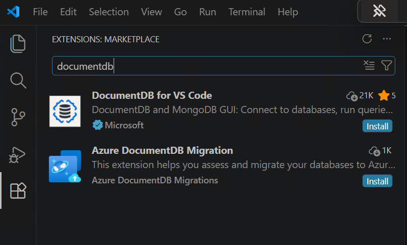

**Duration:** 2 hours

Assess a provided MongoDB source, migrate its data to the predeployed Azure
DocumentDB target, and validate the result.

## Lab format

1. Connect to the provided source and target environments.
2. Run and review a pre-migration assessment.
3. Perform or observe an offline migration.
4. Compare source and target data.
5. Review online migration and cutover behavior.

## Python, C#, and Node.js participants

Migration is performed by the VS Code migration extension or MongoDB database
tools, not by application code. Python, C#, and Node.js participants therefore
follow the same migration steps. Validation protects the collection names,
document shapes, and indexes consumed by all three application languages.

## Learning Goals

- Connect to a source MongoDB cluster and destination Azure DocumentDB from VS Code.
- Run a pre-migration assessment.
- Perform migration.
- Validate that data and application behavior are preserved.

## Prerequisites

* Complete the [Module 1 environment-access lab](../1-DocumentDB-Introduction-and-Cluster-Setup/cluster-setup.md)
* Obtain the MongoDB source connection details from the instructor
* Use the DocumentDB and Azure DocumentDB Migration extensions provided on the
  workshop VM

## Lab step 1: Connect to the source and target

1. Open the preconfigured VS Code workspace on the workshop VM.
2. Open **Extensions**.
3. Confirm that **DocumentDB for VS Code** and **Azure DocumentDB Migration**
  are installed and enabled. If either extension is missing, report the VM
  name to the instructor.



4. Open the DocumentDB extension view.
5. Add a MongoDB connection using the source connection string provided by the instructor.
6. Confirm that the source cluster appears in the connections pane.
7. Select the predeployed Azure DocumentDB target when the migration workflow asks for the destination.
8. Confirm that both source MongoDB and destination Azure DocumentDB appear in the migration workflow.

## Lab step 2: Run the pre-migration assessment

This is the most important step before any migration.

1. Right-click the MongoDB source connection.
2. Select the data migration option.
3. If VS Code reports that the Azure DocumentDB Migration extension is missing,
  stop and report the VM name to the instructor.
4. If you see a card named **Migration to Azure DocumentDB**, click it.
5. Then choose **Pre-Migration Assessment for Azure DocumentDB**.
6. Validate the source connection.
7. Enter an assessment name.
8. Start the assessment.
9. When it completes, review the report.

### Review the Report For

- Compatibility findings
- Unsupported or partially supported features
- Index or query considerations
- Migration recommendations

### Discussion Prompt

Before proceeding, "What would block a clean migration if this were production?"

## Lab step 3: Perform an offline migration

Choose one of the following options.

### Option 1: VS Code Migration Wizard (Recommended)

1. Right-click the MongoDB source again.
2. Select **Migrate to Azure DocumentDB**.
3. Create a migration job.
4. Select **Offline** migration mode.
5. Choose public networking unless the instructor says otherwise.
6. Select the Azure subscription, resource group, and target cluster.
7. Create or reuse an Azure DMS instance.
8. Update firewall rules if prompted.
9. Select the database and collection set to migrate.
10. Start the migration.

### Option 2: CLI Export/Import (`mongoexport` + `mongoimport`)

Use this only when the migration wizard is unavailable and the instructor
provides source and target connection strings for the migration exercise. The
application samples continue to use Microsoft Entra ID.

MongoDB Database Tools are provided on the workshop VM. Verify that
`mongoimport` is available:

```powershell
mongoimport --version
```

Run `mongoexport` and `mongoimport` from terminal (PowerShell or CMD), not inside `mongosh`.

1. Export from source MongoDB:

```bash
mongoexport --uri "<source-connection-string>" --db "<database_name>" --collection "<collection_name>" --out "<collection_name>.json" --jsonArray
```

2. Import into Azure DocumentDB target:

```bash
mongoimport --uri "<target-connection-string>" --db "<database_name>" --collection "<collection_name>" --file "<collection_name>.json" --jsonArray
```

3. Repeat for each required collection.

### Option 3: `mongosh` Import from JSON

Use this only for the included sample JSON when `mongoimport` is unavailable
and the instructor provides a temporary target connection string. Use Option 1
or Option 2 when migrating another source.

```bash
mongosh "<target-connection-string>"
```

Then run:

```javascript
use docdbworkshop

const data = JSON.parse(fs.readFileSync("sample-data/movies_with_vectors.json", "utf8"))

db.movies.insertMany(data)
```

> Option 2 and Option 3 are offline copy/import methods. They do not provide online replication state tracking or cutover orchestration.

## Lab step 4: Monitor and validate

Track the job until it reaches `Succeeded`.

After migration, compare source and target counts.

```javascript
use <database_name>

db.getCollectionNames().forEach(function(c) {
  print(c + ": " + db.getCollection(c).countDocuments());
});
```

Validate:

- Collections exist in the target.
- Document counts are aligned.
- Sample application queries still work.

## Lab step 5: Review online migration and cutover

Depending on workshop time and environment readiness, this may be run as either a participant activity or an instructor demo.

> **Watch:** [Online migration walkthrough (6:52 - 15:17)](https://youtu.be/OYtmeH0TSm4?t=410)

Key points to show:

1. Start an online migration job.
2. Observe the states: provisioning, bulk copy, replication, ready to cutover.
3. Stop write activity before cutover.
4. Execute cutover.
5. Re-run the validation query.

## Recommended Time Split

- 20 min: verify target access and connect source and target
- 30 min: pre-migration assessment
- 40 min: offline migration job setup and monitoring
- 20 min: validation
- 10 min: online migration concept and cutover demo

## Lab success check

* [ ] You connected to the provided MongoDB source
* [ ] You selected the predeployed Azure DocumentDB target
* [ ] You ran and reviewed a pre-migration assessment
* [ ] You resolved or documented blocking compatibility findings
* [ ] You created or observed an offline migration
* [ ] You compared source and target collection counts
* [ ] You ran at least one representative query against migrated data
* [ ] You can explain when online migration and cutover are required

## Troubleshooting

Use this quick list when commands fail during the workshop.

### 1) `mongosh` command not found

Open a new VS Code terminal and run `mongosh --version`. If the command remains
unavailable, report the VM name to the instructor. Do not install software on
the workshop VM.

### 2) `mongoimport` command not found

Open a new VS Code terminal and run `mongoimport --version`. If the command
remains unavailable, report the VM name to the instructor. MongoDB Database
Tools are part of the preconfigured VM.

As a direct fallback, run by full path (adjust version folder if needed):

```cmd
"C:\Program Files\MongoDB\Tools\100\bin\mongoimport.exe" --version
```

### 3) `mongoimport` used inside `mongosh`

`mongoimport` is a terminal tool, not a `mongosh` command.

- Run `mongoimport` in CMD or PowerShell.
- Run `db.*` commands inside `mongosh`.

### 4) Instructor-provided connection string issues

Options 2 and 3 require connection strings supplied by the instructor. Always
wrap the full value in double quotes:

```bash
mongosh "<target-connection-string>"
```

Without quotes, terminal parsing can break on query string separators.

### 5) `ECONNREFUSED 127.0.0.1:27017`

This happens when running plain `mongosh` with no URI. It tries local MongoDB.

Use:

```bash
mongosh "<target-connection-string>"
```

### 6) Network timeout or authentication failed

Check in this order:

1. Confirm that the predeployed cluster status is running.
2. Confirm that the workshop subscription is active in Azure CLI.
3. Confirm that your workshop role assignments are available.
4. For Options 2 and 3 only, verify the instructor-provided connection string.